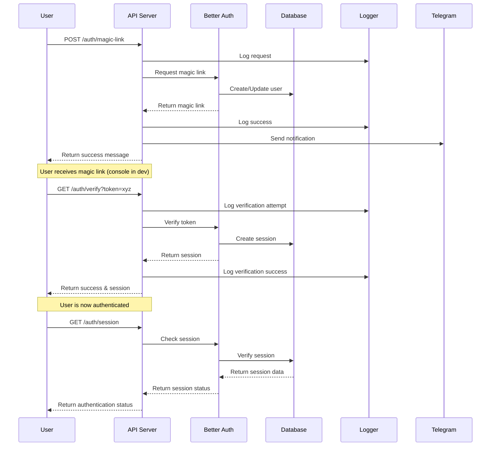

```mermaid
sequenceDiagram
    participant U as User
    participant API as API Server
    participant BA as Better Auth
    participant DB as Database
    participant L as Logger
    participant T as Telegram

    U->>API: POST /auth/magic-link
    API->>L: Log request
    API->>BA: Request magic link
    BA->>DB: Create/Update user
    BA-->>API: Return magic link
    API->>L: Log success
    API->>T: Send notification
    API-->>U: Return success message

    Note over U,API: User receives magic link (console in dev)

    U->>API: GET /auth/verify?token=xyz
    API->>L: Log verification attempt
    API->>BA: Verify token
    BA->>DB: Create session
    BA-->>API: Return session
    API->>L: Log verification success
    API-->>U: Return success & session

    Note over U,API: User is now authenticated

    U->>API: GET /auth/session
    API->>BA: Check session
    BA->>DB: Verify session
    DB-->>BA: Return session data
    BA-->>API: Return session status
    API-->>U: Return authentication status
```
